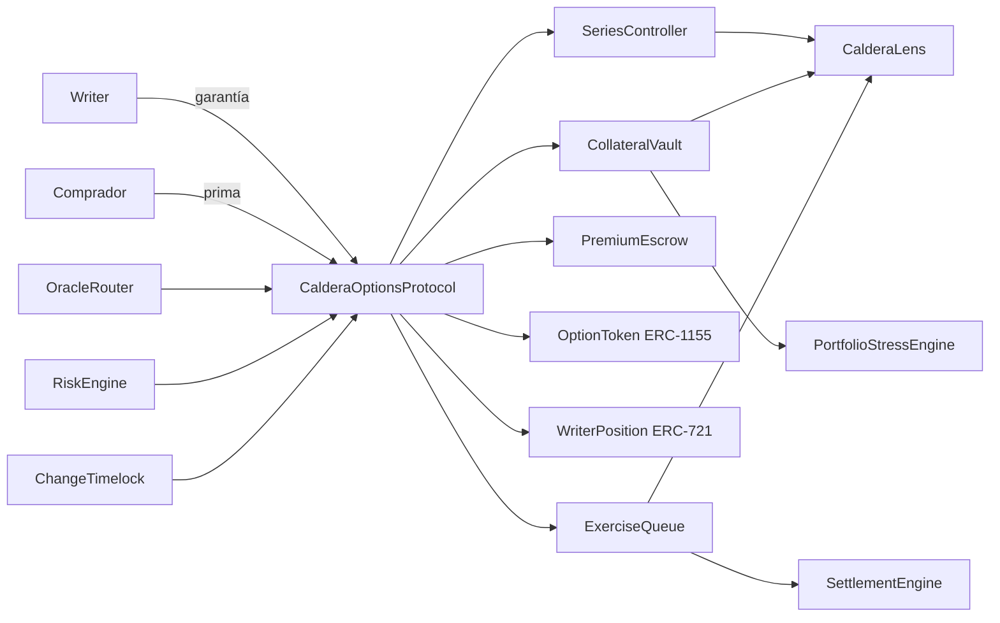
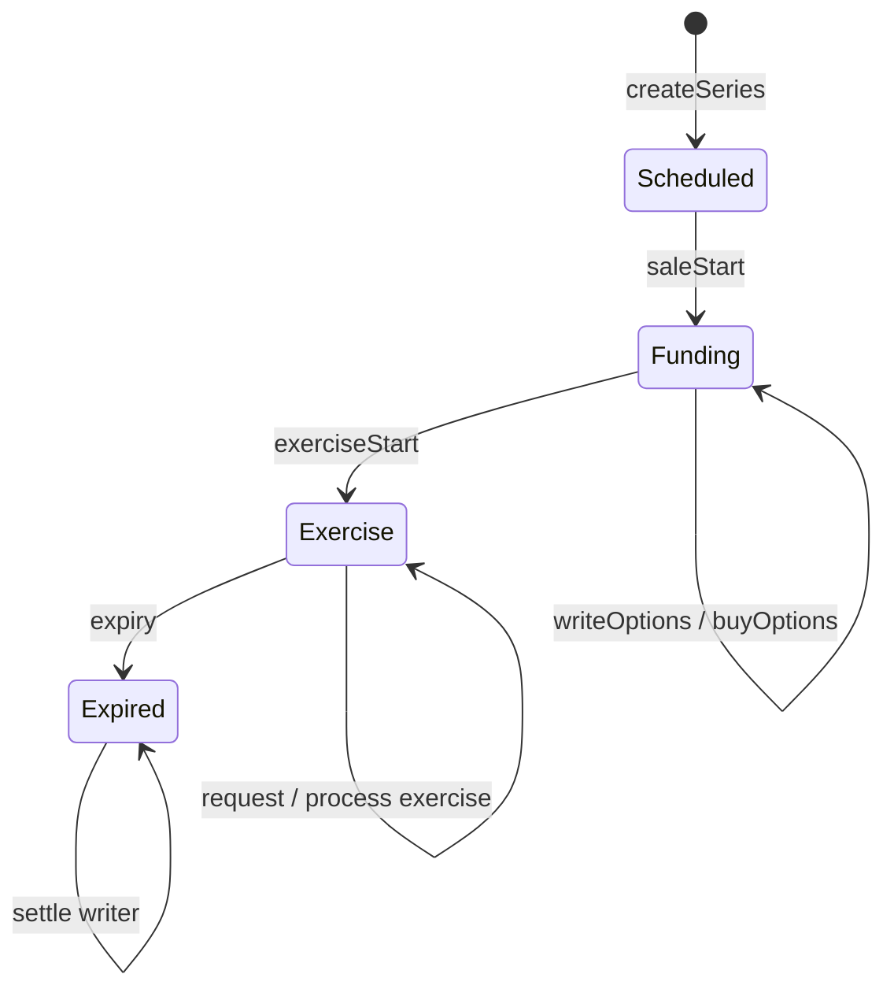
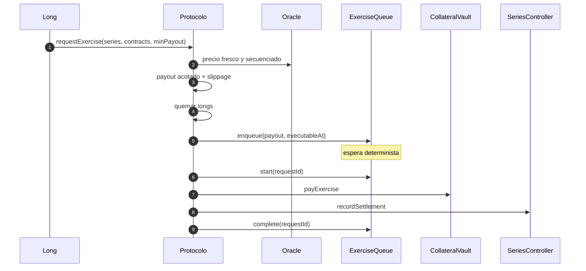
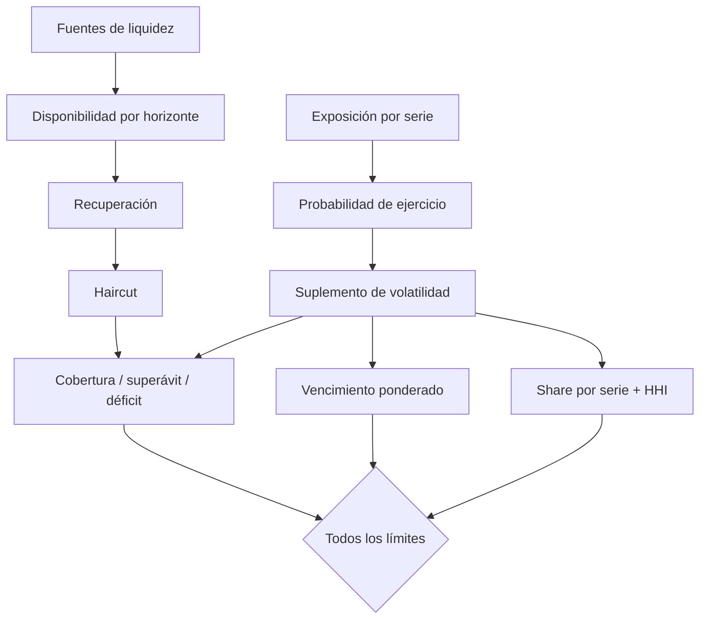
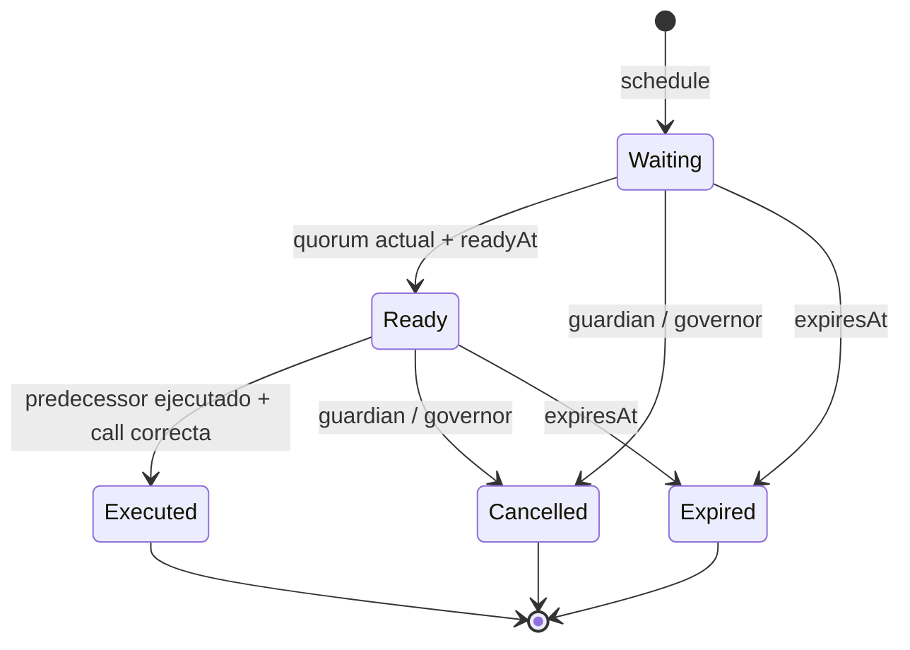

# CalderaOptionsProtocol


[](https://github.com/SolguardLabs/CalderaOptionsProtocol/actions/workflows/ci.yml)
[](https://github.com/SolguardLabs/CalderaOptionsProtocol/actions/workflows/release-integrity.yml)
[](https://github.com/SolguardLabs/CalderaOptionsProtocol/releases/tag/v1.0.0)

CalderaOptionsProtocol es una infraestructura on-chain para emitir, negociar y liquidar opciones
europeas cubiertas mediante pago monetario. Cada serie define activo de garantía, subyacente,
strike, cap, tamaño, ventanas y demora de settlement. Los writers bloquean el pago máximo; los
compradores reciben posiciones ERC-1155 y las solicitudes de ejercicio se procesan mediante una
cola determinista. **Production 1.0.0** añade estrés de cartera, gobierno con timelock y un SDK
TypeScript estricto.

## Arquitectura

La fachada coordina módulos con responsabilidades estrechas. La custodia de garantía y la de primas
permanecen separadas; las posiciones long y writer tienen ciclos independientes; precio, riesgo,
cola y settlement exponen cálculos reproducibles.



`CalderaAccessController` separa administrador, gobierno, guardián y gestor de oracle. Los módulos
con estado se enlazan una sola vez a la fachada y rechazan llamadas directas. `ReentrancyGuard`
protege entradas monetarias y las transferencias comprueban variaciones exactas de balance.

## Ciclo de una serie



1. Gobierno registra garantía y feed, y publica términos inmutables.
2. Writers bloquean el payout máximo y reciben posiciones ERC-721.
3. Compradores pagan prima y reciben longs ERC-1155 hasta agotar inventario.
4. Durante ejercicio, el long fija precio y payout, se quema y entra en cola.
5. Tras `settlementDelay`, cualquier keeper procesa una solicitud madura.
6. Al vencer la serie, los writers liquidan garantía restante y primas.

## Modelo económico

Los precios usan WAD (`10^18`) y los porcentajes BPS (`10.000`). Para una call cubierta:

```text
intrinsic_call = max(min(spot, cap) - strike, 0)
max_call       = cap - strike
```

Para una put:

```text
intrinsic_put = max(strike - spot, 0)
max_put       = strike
```

El importe por contrato se ajusta por `contractSizeX18` y se escala a los decimales de la
garantía. El colateral máximo redondea hacia arriba; el payout realizado redondea hacia abajo:

```text
payout = floor(intrinsicX18 * contractSizeX18 / 10^18 / 10^(18-decimals))
collateralMax = ceil(ceil(maxPriceX18 * contractSizeX18 / 10^18) / 10^(18-decimals))
```

La prima suma valor intrínseco, valor temporal y utilización, limitada por la garantía por
contrato. La comisión se separa antes de indexar el importe de writers. Consulte
[docs/economic-model.md](./docs/economic-model.md).



## Riesgo de cartera

`PortfolioStressEngine` analiza un activo por horizonte. Cada fuente recibe recuperación y haircut;
cada exposición recibe probabilidad de ejercicio y suplemento de volatilidad. Las entradas deben
estar en orden canónico y el informe termina en un digest `keccak256` ligado a todos los supuestos.



```text
effective_i = amount_i * recovery_i / 10_000 * (10_000 - haircut_i) / 10_000
stressed_j  = nominal_j * (probability_j + volatilityAddon_j) / 10_000
coverage    = sum(effective_i) * 10_000 / sum(stressed_j)
HHI         = sum(seriesShare_j^2 / 10_000)
```

El dictamen combina cobertura mínima, déficit máximo, concentración, HHI y vencimiento ponderado.
Véase [docs/portfolio-risk.md](./docs/portfolio-risk.md).

## Gobierno de cambios

`ChangeTimelock` liga cada operación a `chainId`, contrato, destino, valor, calldata, salt,
predecesor y ventana. Solo governors programan, aprueban y ejecutan. El quórum se recalcula con los
roles vigentes: una aprobación deja de contar si su firmante pierde el rol. Guardian o gobierno
pueden cancelar antes de la ejecución.



Los procedimientos están en [docs/governance.md](./docs/governance.md).

## Controles principales

- Garantía máxima conocida antes de crear la serie y cap de depósito por activo.
- Oracle secuenciado, normalizado, no futuro y sujeto a antigüedad máxima.
- Cotizaciones ligadas a cantidad máxima de prima y ejercicios a payout mínimo.
- Inventario vendido limitado por contratos escritos y supplies observables.
- Custodia de garantía separada de primas y fees.
- Solicitudes inmutables, demora, estados monotónicos y lote acotado.
- Pausa de emergencia sin dependencia de un keeper exclusivo.
- Timelock con quórum actual, predecesor, gracia y protección de reentrada.
- CI reproducible en Linux y Windows, dependencias fijadas e integridad del release.

## Inicio rápido

Requisitos: Foundry 1.7.1, Solidity 0.8.24, Node.js 24 y Bun 1.3.14.

```bash
git submodule update --init --recursive
bun install --frozen-lockfile
bash scripts/ci.sh
```

En Windows:

```powershell
./scripts/ci.ps1
```

Validaciones individuales:

```bash
forge fmt --check
forge build --sizes
forge test
FOUNDRY_PROFILE=ci forge test
bun run test:ts
bun run verify:repo
```

Ejemplo de cálculo local desde el SDK:

```ts
import { atomic, maximumCollateral, optionPayout } from "./sdk/CalderaClient.js";

const WAD = 10n ** 18n;
const payout = optionPayout(
    "call",
    atomic(3_500n * WAD),
    atomic(2_000n * WAD),
    atomic(3_000n * WAD),
    atomic(WAD),
    "2",
    6,
);
const collateral = maximumCollateral(
    "call",
    atomic(2_000n * WAD),
    atomic(3_000n * WAD),
    atomic(WAD),
    "2",
    6,
);
```

## Estructura

```text
src/
  access/       roles y pausa
  assets/       catálogo de garantías
  core/         series, vault, primas, cola y settlement
  governance/   timelock, quórum y dependencias
  lens/         vistas agregadas
  libraries/    matemática y transferencias
  oracle/       precio, secuencia y frescura
  pricing/      curva de primas
  risk/         validación de serie y estrés de cartera
  token/        longs ERC-1155 y posiciones writer ERC-721
sdk/            cliente TypeScript y cálculos bigint
test/           unitarias, fuzz, invariantes y nuevos controles
docs/           diseño, economía, riesgo, gobierno y operación
```

## Documentación

| Documento                                     | Contenido                                          |
| --------------------------------------------- | -------------------------------------------------- |
| [Arquitectura](./docs/architecture.md)        | Componentes, fronteras y consistencia              |
| [Modelo económico](./docs/economic-model.md)  | Payout, colateral, prima, índices y redondeo       |
| [Gobierno](./docs/governance.md)              | Timelock, quórum, predecesores y cancelación       |
| [Operaciones](./docs/operations.md)           | Telemetría, conciliación y cadencia                |
| [Riesgo de cartera](./docs/portfolio-risk.md) | Escenarios, cobertura, vencimiento y HHI           |
| [Runbooks](./docs/runbooks.md)                | Pausa, oracle, liquidez, cola y recuperación       |
| [SDK](./docs/sdk.md)                          | Transporte, idempotencia, tipos y cálculos locales |

## Seguridad y entrega

Consulte [SECURITY.md](./SECURITY.md) para comunicación privada y expectativas de investigación.
`v1.0.0` se publica desde `production`; la etiqueta anotada, la rama y el checkout validado deben
resolver al mismo commit. El workflow de integridad repite la puerta completa al crear la etiqueta
y al publicar el release.

## Licencia

MIT. Consulte [LICENSE](./LICENSE).
