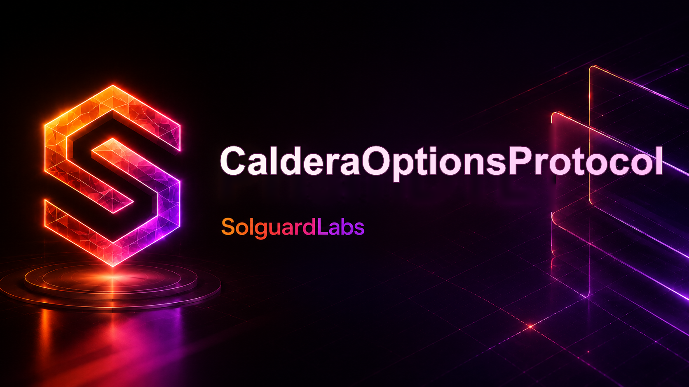

# Caldera Options Protocol



Caldera es un protocolo on-chain para emitir y liquidar opciones cubiertas con
settlement monetario. Los escritores aportan el colateral máximo de cada
contrato, los compradores adquieren posiciones long representadas como tokens
ERC-1155 y las solicitudes de ejercicio se liquidan mediante una cola
determinista.

El diseño utiliza calls con techo de precio y puts con suelo cero. Esta
acotación permite conocer el payout máximo antes de abrir la serie y exigir el
colateral completo durante la fase de financiación.

## Componentes

- `CalderaOptionsProtocol`: fachada de escritura, compra, ejercicio y cobro.
- `SeriesController`: términos, fases e índices contables de cada serie.
- `CollateralVault`: custodia agregada y reservas denominadas por activo.
- `PremiumEscrow`: separación de primas, comisiones y pagos a escritores.
- `ExerciseQueue`: solicitudes inmutables con demora de liquidación.
- `SettlementEngine`: instrucciones de payout e índices de pérdida.
- `OptionToken`: posiciones long fungibles por serie mediante ERC-1155.
- `WriterPosition`: recibos ERC-721 transferibles para los escritores.
- `RiskEngine`: validación de ventanas y cálculo de colateral máximo.
- `PremiumModel`: cotización por valor intrínseco, tiempo y utilización.
- `OracleRouter`: precios normalizados a 18 decimales con control de frescura.
- `CalderaLens`: snapshots de mercado, posiciones, cola y solvencia.

## Ciclo de una serie

1. Gobierno registra el activo de colateral y publica el feed del subyacente.
2. Se crea una serie con strike, cap, tamaño, ventanas y demora de settlement.
3. Los escritores bloquean el payout máximo y reciben posiciones ERC-721.
4. Los compradores pagan la prima y reciben longs ERC-1155.
5. Durante la ventana de ejercicio, un long fija su payout y entra en cola.
6. Una vez cumplida la demora, cualquier cuenta puede procesar la solicitud.
7. Tras el vencimiento, los escritores liquidan su posición y cobran primas.

## Requisitos

- Foundry 1.7 o superior.
- Solidity 0.8.24, descargado automáticamente por Foundry si no está cacheado.
- Bash o PowerShell para los scripts de validación local.

## Instalación y uso

```bash
forge build
forge test
```

`forge-std` se incluye en `lib/` para que el proyecto pueda compilarse sin un
paso de instalacion adicional.

Para ejecutar todas las comprobaciones utilizadas en CI:

```bash
bash scripts/ci.sh
```

En Windows puede usarse el equivalente nativo:

```powershell
powershell -ExecutionPolicy Bypass -File scripts/ci.ps1
```

La suite ampliada puede ejecutarse con el perfil de CI:

```bash
FOUNDRY_PROFILE=ci forge test
```

## Despliegue local

Inicia un nodo Anvil y define la clave del desplegador:

```bash
anvil
export PRIVATE_KEY=<clave-local>
forge script script/DeployCaldera.s.sol:DeployCaldera \
  --rpc-url http://127.0.0.1:8545 --broadcast
```

El script despliega los módulos, enlaza la fachada y deja al desplegador con
los roles administrativos iniciales. Los activos y feeds se configuran después
según el mercado que se quiera publicar.

## Estructura

```text
src/
  access/       roles operativos
  assets/       catálogo de colaterales
  core/         series, custodia, primas, cola y settlement
  errors/       errores tipados
  lens/         vistas agregadas
  libraries/    matemática y transferencias ERC-20
  oracle/       precios y frescura
  pricing/      cotización de primas
  risk/         validación y payouts
  token/        posiciones long y writer
  types/        structs y enums compartidos
test/
  helpers/      fixture común
  mocks/        activos de prueba
script/         despliegue Foundry
scripts/        validación reproducible
```

## Calidad

El proyecto fija compilador, EVM, optimizador y remappings. La integración
continua comprueba formato, tamaño del árbol fuente, compilación, tamaños de
bytecode y tests unitarios, fuzz e invariantes con el mismo perfil disponible
localmente.

## Licencia

MIT.
