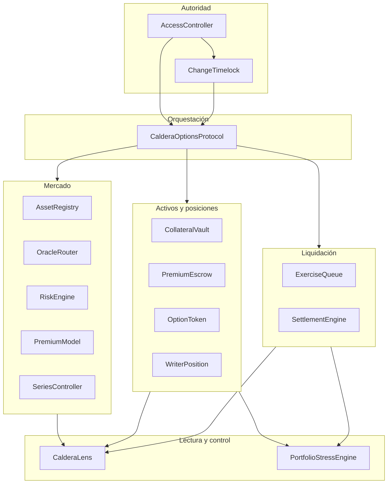
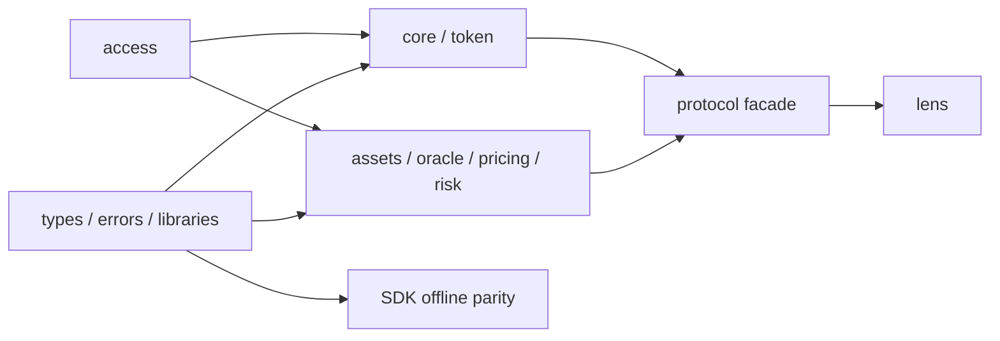

# Arquitectura

## Fronteras del sistema

Caldera separa configuración, precio, riesgo, custodia, posiciones y liquidación. La fachada
`CalderaOptionsProtocol` es el único orquestador monetario. Los módulos con estado se enlazan una
sola vez a su dirección y aplican `onlyProtocol`; las consultas permanecen abiertas para clientes,
keepers y supervisión.

## Responsabilidades

`AssetRegistry` almacena decimales, símbolo, cap y habilitación. `OracleRouter` conserva la última
observación por subyacente y exige secuencia creciente, timestamp no futuro y frescura. `RiskEngine`
valida términos y calcula garantía máxima. `PremiumModel` combina intrínseco, tiempo y utilización.
`SeriesController` persiste configuración inmutable e índices contables.

`CollateralVault` custodia garantía agregada y mantiene reserva por serie. `PremiumEscrow` separa
primas de writers y fees. `OptionToken` representa longs fungibles por serie; `WriterPosition`
representa recibos transferibles con entradas de índice propias.

`ExerciseQueue` fija la obligación y el primer instante procesable. `SettlementEngine` genera la
instrucción esperada; la fachada compara esa instrucción con el resultado del vault antes de
actualizar pérdidas y cerrar la solicitud. `CalderaLens` agrega vistas sin escribir estado.

## Dependencias

Las bibliotecas matemáticas y tipos compartidos no dependen de servicios. El acceso es una
dependencia transversal. Los módulos no se llaman entre sí para mover fondos: la fachada establece
el orden y permite observar una transición completa.

## Consistencia de transacciones

Una compra valida fase, cantidad, inventario y `maximumPremium`; cobra prima; registra venta e
índice; y finalmente acuña longs. Un ejercicio valida ventana, precio y `minimumPayout`; quema
longs; y después crea la solicitud. Si una llamada revierte, EVM restaura todos los módulos.

El procesamiento sigue `start → preview → pay → recordSettlement → complete`. El estado
`Processing` impide replay dentro de la llamada y la protección de reentrada impide recuperar el
control durante transferencias externas.

## Modelo de lectura

Interfaces deben leer una vista en un mismo bloque. `seriesSnapshot` combina configuración,
contabilidad, fase, supply, inventario, reserva y cola. `assetSnapshot` combina configuración,
solvencia del vault y pasivos de primas. Un consumidor que mezcle bloques debe etiquetar cada
resultado y aceptar que no representa un snapshot atómico.

## Extensión

Una nueva opción debe conservar payout finito y garantía calculable antes de escribir. Un activo
nuevo debe respetar transferencias exactas. Una acción sensible debe programarse en el timelock.
Una métrica nueva no debe convertirse en autoridad monetaria sin definir unidad, redondeo,
frecuencia y reconciliación.

## Reproducibilidad

El compilador, EVM, optimizador y metadatos están fijados en `foundry.toml`. Los submódulos y
herramientas TypeScript tienen locks. CI ejecuta la misma secuencia en Linux y Windows, y el release
repite esa puerta sobre la etiqueta inmutable.
