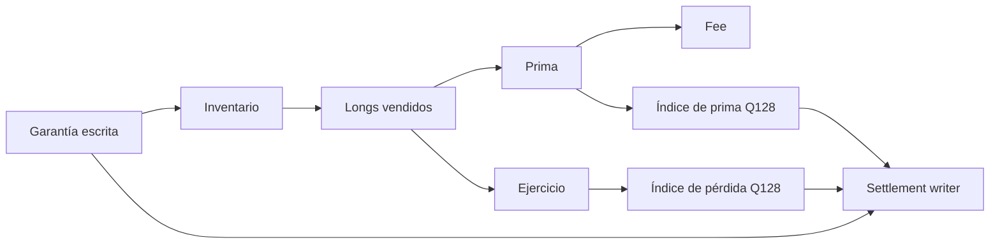

# Modelo económico

## Unidades

Precios, strikes, caps y tamaño de contrato usan WAD (`10^18`). Porcentajes usan BPS (`10.000`).
La garantía usa unidades atómicas del ERC-20, entre 1 y 18 decimales. Todas las divisiones declaran
dirección de redondeo; no se usa coma flotante.

## Payout

Una call queda limitada por su cap:

```text
effectiveSpot = min(spot, cap)
intrinsicCall = max(effectiveSpot - strike, 0)
maximumCall   = cap - strike
```

Una put tiene suelo implícito cero:

```text
intrinsicPut = max(strike - spot, 0)
maximumPut   = strike
```

Para tamaño `q` y decimales `d`:

```text
quoteX18   = floor(intrinsicX18 * q / 10^18)
payoutUnit = floor(quoteX18 / 10^(18-d))
payout     = payoutUnit * contracts
```

La garantía máxima aplica techo en ambas conversiones para no quedar una unidad por debajo:

```text
maxQuoteX18 = ceil(maximumX18 * q / 10^18)
collateralPerContract = ceil(maxQuoteX18 / 10^(18-d))
```

Ejemplo: call ETH con strike 2.000, cap 3.000, tamaño 1 ETH y USDC de 6 decimales. La garantía
máxima es 1.000 USDC por contrato. A spot 2.500, payout 500 USDC; a 3.500, el cap limita el pago a
1.000 USDC.

## Inventario

Cada escritura bloquea `collateralPerContract * contracts`. La serie registra contratos escritos y
vendidos. Una compra solo se admite si:

```text
soldContracts + requestedContracts <= writtenContracts
```

El supply long se acuña tras cobrar la prima. Una solicitud de ejercicio quema los contratos
solicitados, de modo que un derecho fijado no permanece transferible.

## Prima

La prima por contrato es:

```text
timeRemaining = clamp((expiry - max(now, saleStart)) / (expiry - saleStart), 0, 1)
timeBps       = minimumPremiumBps + timeValueBps * timeRemaining
timeValue     = collateral * timeBps / 10_000
utilization   = min((sold + requested) / written, 1)
utilValue     = collateral * utilizationValueBps / 10_000 * utilization
premium       = min(collateral, intrinsic + timeValue + utilValue)
```

El comprador fija `maximumPremium`. Sobre el total, `feeBps` se separa como fee y el resto aumenta
el índice de prima para writers.

## Índices Q128

Primas y pérdidas se distribuyen por contrato escrito mediante índices Q128:

```text
deltaIndex = floor(amount * 2^128 / shares)
remainder  = (amount * 2^128 mod shares) + previousRemainder
```

Si el resto alcanza `shares`, se incorpora al índice. Cada posición conserva el índice de entrada
y calcula su parte con `contracts * (index - entry) / 2^128`. Esta técnica evita bucles sobre
writers y conserva fracciones entre actualizaciones.



## Cancelación y settlement

Las series europeas no permiten ejercicio antes de `exerciseStart`. El precio y payout se fijan al
solicitar. Tras la demora, el keeper procesa exactamente ese importe. El writer puede reclamar
prima durante la vida de la posición y liquida garantía restante después de `expiry` según el índice
de pérdidas procesadas.

## Sensibilidades

Mayor cap o strike de put eleva garantía. Mayor tiempo eleva prima temporal. Mayor utilización
incrementa el componente de escasez. Mayor demora desplaza liquidez exigible. El modelo de
[portfolio-risk.md](./portfolio-risk.md) trata conjuntamente nominal, probabilidad, volatilidad,
disponibilidad y concentración.
