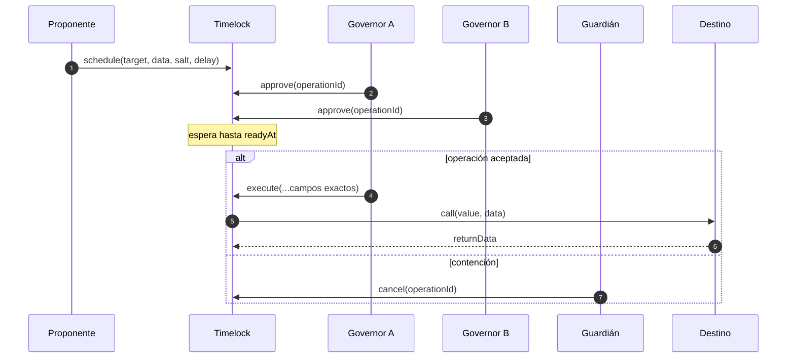
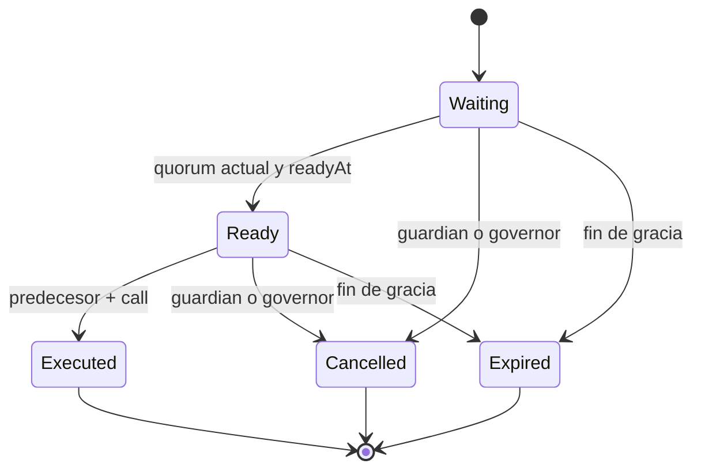

# Gobierno de cambios

## Modelo

`ChangeTimelock` impide que una identidad aplique inmediatamente una llamada sensible. La identidad
de una operación incluye dominio, `chainId`, dirección del timelock, destino, ETH, digest de calldata,
predecesor, salt y ventana exacta. La misma intención en otra red o contrato produce otro id.

```text
operationId = keccak256(
  domain, chainId, timelock, target, value, keccak256(data),
  predecessor, salt, readyAt, expiresAt
)
```

## Programación

Solo `GOVERNOR_ROLE` programa. `delay` debe estar entre mínimo y máximo. `readyAt` se deriva del
timestamp y `expiresAt = readyAt + gracePeriod`; el llamante no puede escoger una expiración que
amplíe la ventana. La operación duplicada se rechaza.

## Aprobaciones

Cada governor aprueba una vez. El quórum se calcula en lectura recorriendo aprobadores y consultando
roles actuales. Si una clave pierde `GOVERNOR_ROLE`, su voto deja de contar sin reescribir el
registro. Esto evita que una aprobación antigua sobreviva a una rotación de autoridad.



## Ejecución

Ejecutar requiere rol vigente, id exacto, ventana abierta, quórum actual y predecesor ejecutado.
El estado se marca antes de la llamada y `ReentrancyGuard` impide entrada recursiva. Si el destino
revierte, toda la transacción revierte y la operación no queda consumida. El evento conserva digest
de los datos retornados.

## Estados



`Ready` puede volver lógicamente a `Waiting` si un aprobador pierde su rol antes de ejecutar. Los
estados finales no se reabren.

## Predecesores

Un cambio puede depender de otro `operationId`. La dependencia se comprueba en ejecución y permite
encadenar, por ejemplo: registrar activo, configurar feed, crear serie. No use ciclos; cada nodo
debe tener salt distinto y una dependencia anterior verificable.

## Ceremonia recomendada

1. Construir calldata con ABI y calcular su digest.
2. Simular resultado, balances y eventos.
3. Ejecutar estrés de cartera con los parámetros propuestos.
4. Elegir salt descriptivo no reutilizado.
5. Programar con demora proporcional al impacto.
6. Verificar id y calldata por canal independiente.
7. Reunir governors de custodias separadas.
8. Confirmar conciliación y predecesores antes de ejecutar.
9. Archivar recibo, retorno y snapshots posterior.

## Emergencia

Guardian o governor pueden cancelar. Una clave dudosa se revoca en `AccessController`; sus votos
dejan de contar inmediatamente. No se reduce el delay para compensar una urgencia. La pausa limita
nueva actividad mientras se prepara una operación separada, revisada y reproducible.
