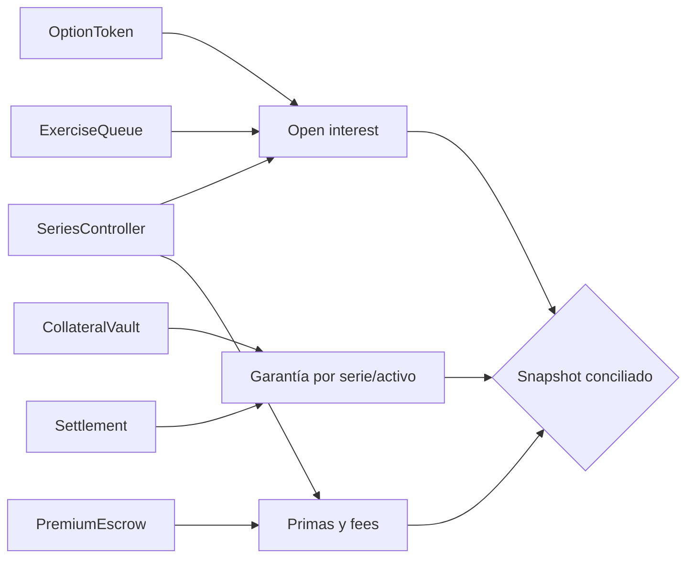

# Operaciones

## Objetivo

Operaciones mantiene precio fresco, garantía observable, cola procesable y estados reconciliados.
Una señal no se resuelve corrigiendo contadores de forma aislada: se preserva el snapshot, se
contiene nueva exposición, se reconstruye la secuencia y se aplica un cambio autorizado.

## Telemetría

| Señal               | Dimensiones           | Frecuencia             | Condición                         |
| ------------------- | --------------------- | ---------------------- | --------------------------------- |
| Frescura del oracle | subyacente, secuencia | Cada observación       | edad <= `maxOracleAge`            |
| Utilización         | serie                 | Cada compra            | vendidos / escritos               |
| Reserva             | serie, activo         | Cada movimiento        | coherente con depósitos y salidas |
| Solvencia           | activo                | Cada bloque operativo  | físico >= contabilizado           |
| Cola pendiente      | serie                 | Continua               | count y payout reconciliados      |
| Antigüedad de cola  | solicitud             | Continua               | procesar desde `executableAt`     |
| Índices             | serie                 | Cada prima/settlement  | monotónicos, resto acotado        |
| Estrés              | activo, horizonte     | Horaria y tras cambios | `withinLimits = true`             |
| Timelock            | operación             | Continua               | estado y quórum actuales          |

Cada muestra incluye bloque, timestamp, versión y digest. Cantidades y BPS se exportan como
enteros, nunca como números de coma flotante.

## Cadencia

### Continua

- Alertar por observación futura, secuencia no creciente o precio caducado.
- Comparar balance físico, garantía contabilizada y débito de liquidez.
- Procesar solicitudes maduras dentro del objetivo operativo.
- Detectar posiciones liquidadas dos veces o solicitudes fuera de estado.
- Vigilar pausas y cambios listos o próximos a expirar.

### Horaria

- Ejecutar escenarios base, volatilidad, liquidez tardía y concentración.
- Revisar mayor share por serie, HHI y vencimiento ponderado.
- Agregar payout pendiente por activo y compararlo con liquidez efectiva.
- Identificar series cerca de cap de depósito o inventario.

### Diaria

- Reconciliar contratos escritos, vendidos, supply long y liquidados.
- Reconciliar primas brutas, fees, índice, pagado y escrow.
- Reconciliar garantía depositada, liberada, pagada y reservas.
- Archivar digests de cartera, cola y autoridad.
- Verificar relaciones de ramas y última etiqueta publicada.

## Conciliación



Relaciones principales:

```text
liveLongSupply + settledContracts == soldContracts
availableInventory == writtenContracts - soldContracts
sum(reserveBySeries(asset)) == accountedCollateralByAsset(asset)
physicalBalance(asset) >= accountedCollateralByAsset(asset)
pendingCountBySeries == number of Pending/Processing requests
pendingPayoutBySeries == sum(payout of Pending/Processing requests)
```

Los restos Q128 se verifican por serie y deben ser menores que el denominador de contratos
escritos.

## Alta de serie

1. Registrar activo y confirmar comportamiento de transferencia.
2. Configurar feed y publicar dos observaciones secuenciadas.
3. Validar términos y garantía máxima fuera de cadena.
4. Ejecutar escenarios de cartera con cap, demora y ventana propuestos.
5. Programar cambio en timelock y obtener quórum.
6. Ejecutar dentro de ventana y comprobar evento `SeriesCreated`.
7. Confirmar snapshot, fase y payout máximo con SDK.
8. Observar la primera escritura y compra de forma reforzada.

## Pausa y reanudación

La pausa detiene nueva actividad económica protegida, pero las vistas siguen disponibles. Se pausa
ante precio dudoso, insolvencia, conciliación negativa o autoridad incierta. Reanudar requiere causa
identificada, snapshot conciliado, oracle fresco, escenarios dentro de límite y autorización de
gobierno.

## Registros

Los logs incluyen identificadores, bloque, timestamp, cantidades necesarias, estado y digest. No
incluyen claves privadas, tokens de API ni cabeceras. La retención cubre la mayor expiración, demora
de settlement, gracia de gobierno y periodo interno de revisión.
