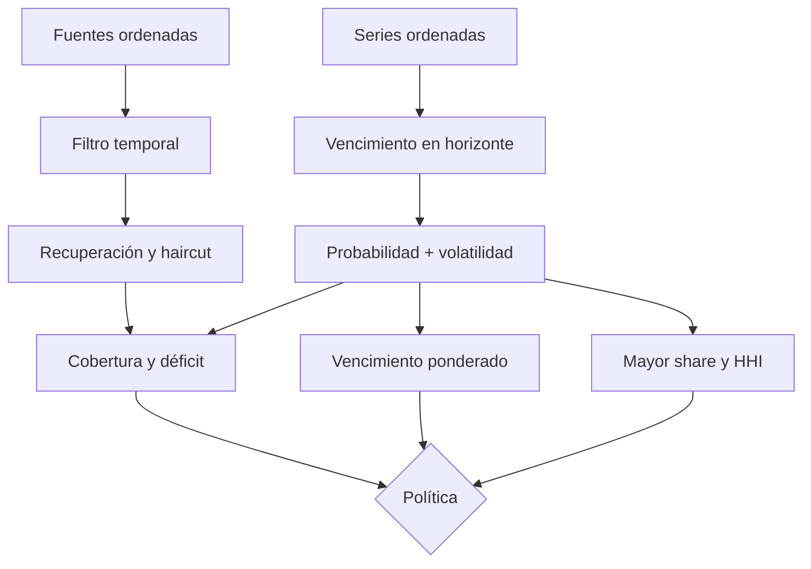

# Riesgo de cartera

## Propósito

`PortfolioStressEngine` evalúa si la liquidez realizable de un activo cubre las salidas de opciones
dentro de un horizonte. La salida es determinista, ordenada y ligada por digest a sus supuestos. No
reemplaza el ledger del vault; complementa su foto presente con una proyección temporal.

## Fuentes

Cada fuente declara `id`, importe, disponibilidad, recuperación y haircut. Los ids se ordenan
estrictamente y no pueden ser cero:

```text
available_i = availableAt_i <= horizonEnd
recovered_i = available_i ? floor(amount_i * recoveryBps_i / 10_000) : 0
haircut_i   = floor(recovered_i * haircutBps_i / 10_000)
effective_i = recovered_i - haircut_i
```

El haircut se aplica al importe recuperado. Una fuente excelente pero tardía aporta cero al
horizonte analizado.

## Exposiciones

Cada serie aporta nominal, vencimiento, probabilidad de ejercicio y suplemento de volatilidad:

```text
due_j      = dueAt_j <= horizonEnd
probable_j = due_j ? floor(nominal_j * probabilityBps_j / 10_000) : 0
addon_j    = due_j ? floor(nominal_j * volatilityAddonBps_j / 10_000) : 0
stressed_j = probable_j + addon_j
maturity_j = max(dueAt_j - asOf, 0)
```

Probabilidad y suplemento están acotados individualmente a 10.000 BPS; la salida adversa puede
alcanzar 200 % del nominal como margen conservador.

## Agregación

```text
S = sum(effective_i)
L = sum(stressed_j)
surplus   = max(S - L, 0)
shortfall = max(L - S, 0)
coverage  = L == 0 ? 20_000 : floor(S * 10_000 / L)
weightedMaturity = L == 0 ? 0 : floor(sum(stressed_j * maturity_j) / L)
```

La concentración se mide por participación y Herfindahl-Hirschman:

```text
share_j = L == 0 ? 0 : floor(stressed_j * 10_000 / L)
HHI     = sum(floor(share_j^2 / 10_000))
```

Una sola serie se acerca a 10.000; dos iguales a 5.000. Por divisiones enteras, las participaciones
pueden sumar unas unidades menos de 10.000.



## Ejemplo

Fuentes: caja 800.000; reserva 400.000 con recuperación 90 % y haircut 10 %; cuenta por cobrar
300.000 fuera de horizonte. Liquidez efectiva: `800.000 + 324.000 = 1.124.000`.

Exposiciones: serie A 300.000 al 100 %; serie B 600.000 al 100 % más 20 %; serie C fuera del
horizonte. Salida: `300.000 + 720.000 = 1.020.000`.

```text
surplus     = 104.000
coverageBps = 11.019
shares      = 2.941 y 7.058 BPS
HHI         = 5.845 BPS
weightedMaturity = 686.117 segundos
```

## Dictamen

`withinLimits` exige simultáneamente:

```text
coverage >= minimumCoverage
shortfall <= maximumShortfall
largestShare <= maximumSeriesShare
HHI <= maximumHhi
weightedMaturity <= maximumWeightedMaturity
```

El digest incluye dominio, activo, tiempos, totales, indicadores, dictamen y todos los resultados.
Operaciones debe archivar también las entradas; el digest por sí solo no explica los supuestos.

## Escenarios

- Base: probabilidades observadas y recuperación contractual.
- Volatilidad: spot en cap/suelo y suplementos elevados.
- Liquidez tardía: excluir fuentes posteriores al vencimiento ponderado.
- Concentración: indisponibilidad de la mayor fuente y ejercicio completo de la mayor serie.
- Cadena de settlement: adelantar vencimientos por congestión y agrupar solicitudes.

Todo cambio de cap, garantía, ventana, demora o fuente exige recalcular los cinco.
