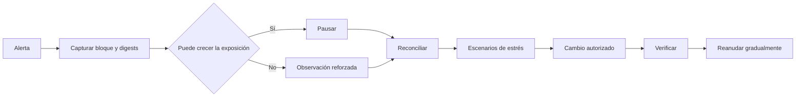

# Runbooks

## Secuencia común

No se modifica un saldo manualmente. Cada medida conserva evidencia previa y posterior.

## Oracle caducado o fuera de secuencia

1. Pausar nuevas series, compras y solicitudes dependientes del feed.
2. Capturar subyacente, secuencia, precio, `updatedAt`, bloque y publisher.
3. Comparar con fuentes independientes aprobadas.
4. Determinar si el problema es transporte, reloj, secuencia o precio.
5. Publicar una observación nueva con secuencia estrictamente mayor; no reescribir historia.
6. Recalcular cotizaciones, payouts y estrés.
7. Reanudar tras una ventana completa con observaciones coherentes.

## Solvencia negativa

**Disparador:** `physicalBalance < accountedCollateral` o crecimiento inesperado de
`liquidityDebitByAsset`.

1. Pausar inmediatamente nueva exposición del activo.
2. Capturar balance físico, contabilizado, reservas por serie, pagos y releases acumulados.
3. Identificar la primera transición tras el último snapshot coincidente.
4. Reproducir en orden locks, releases y pagos.
5. No compensar una serie con ajustes de otra.
6. Ejecutar escenario sin la mayor fuente de liquidez.
7. Preparar recapitalización o reducción de exposición mediante timelock.
8. Reanudar solo con balance cubierto, conciliación completa y límites cumplidos.

## Cola envejecida

**Disparador:** solicitud madura no procesada dentro del objetivo.

1. Verificar estado `Pending`, `executableAt`, pausa y disponibilidad de gas.
2. Simular `processExercise` en el bloque actual.
3. Comparar payout fijo con reserva, balance y preview de settlement.
4. Procesar individualmente antes de usar lote.
5. Si revierte, conservar revert data y no marcar la solicitud fuera de cadena como cerrada.
6. Escalar si la demora efectiva desplaza el vencimiento ponderado fuera de política.

## Diferencia de open interest

1. Capturar `writtenContracts`, `soldContracts`, `settledContracts` y supply long.
2. Enumerar solicitudes y sumar contratos por estado.
3. Revisar eventos de mint, burn y settlement desde la última reconciliación.
4. Confirmar que no se mezclaron bloques en la vista.
5. Pausar si la diferencia permite crear o extinguir derechos económicos.
6. Aplicar corrección solo mediante una transición revisada y autorizada.

## Timelock dudoso

**Disparador:** calldata no reconocida, aprobador rotado, predecesor incompleto o operación cerca de
expirar.

1. No ejecutar aunque el estado aparezca `Ready`.
2. Recalcular id con chain, contrato, target, value, calldata, salt y ventana.
3. Comparar digest con la propuesta revisada.
4. Revocar la cuenta si su custodia es incierta; su voto deja de contar.
5. Cancelar con guardian o governor.
6. Programar una operación nueva; no reutilizar salt ni ampliar la anterior.

## Integración degradada

1. Consultar salud y conservar `stateDigest`.
2. Separar timeout, rechazo HTTP, JSON incorrecto y esquema inesperado.
3. No considerar una respuesta parcial como confirmación.
4. Antes de reintentar una operación monetaria, consultar su estado por id.
5. Reutilizar la misma clave de idempotencia para la misma intención.
6. Usar una clave nueva si cambia cualquier campo económico.

## Cierre

Se cierra cuando causa y alcance están documentados, balances y estados concilian, escenarios
cumplen, la medida está autorizada, las pruebas reproducen el resultado esperado y una ventana de
observación no muestra recurrencia.
