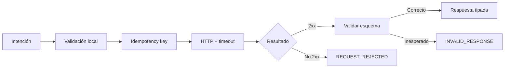

# SDK TypeScript

## Alcance

`sdk/CalderaClient.ts` ofrece transporte HTTP sin dependencias de ejecución, tipos de respuestas,
validación fail-closed, idempotencia y paridad local de payout y garantía. Requiere Node.js 24 para
`fetch`, `AbortSignal.timeout` y SHA-256 nativos.

```ts
import { CalderaClient, HttpCalderaTransport } from "./sdk/CalderaClient.js";

const client = new CalderaClient(
    new HttpCalderaTransport({
        baseUrl: "https://api.example.invalid/",
        apiKey: process.env.CALDERA_API_KEY,
        timeoutMs: 8_000,
    }),
);
await client.requireHealthy();
```

La configuración operativa debe usar HTTPS. El token vive en memoria y no debe aparecer en logs.

## Cantidades

Las cantidades de red son cadenas enteras no negativas. No se admiten signos, decimales ni
notación exponencial. `atomic` acepta `bigint`, string o `number` entero seguro:

```ts
import { atomic } from "./sdk/CalderaClient.js";

const contracts = atomic(2n);
const maximumPremium = atomic(900_000_000n);
```

Para valores financieros use `bigint` o string.

## Lectura y cotización

```ts
const series = await client.series("series:eth-call-2026-09");
const quote = await client.quote(series.seriesId, "2");
```

El cliente codifica identificadores de ruta y valida tipo, fase, cantidades, expiración y digest.
Una respuesta desconocida produce `CalderaClientError("INVALID_RESPONSE")`.

## Operaciones

```ts
import { deriveIdempotencyKey } from "./sdk/CalderaClient.js";

const intent = {
    account: "account:writer-01",
    seriesId: "series:eth-call-2026-09",
    contracts: "2",
    recipient: "account:writer-01",
    maximumCollateral: "2000000000",
};
const key = deriveIdempotencyKey("write:2026-08-15", intent);
const operation = await client.write(intent, key);
```

`buy` usa `maximumPremium`; `requestExercise` usa `minimumPayout`; `processExercise` acepta id de
solicitud; `settleWriter` acepta posición y destinatario. Cada escritura exige una clave de 16 a 160
caracteres. La misma intención reutiliza clave; cualquier cambio requiere otra.

## Cálculo local

```ts
import { atomic, maximumCollateral, optionPayout } from "./sdk/CalderaClient.js";

const WAD = 10n ** 18n;
const payout = optionPayout(
    "call",
    atomic(3_500n * WAD),
    atomic(2_000n * WAD),
    atomic(3_000n * WAD),
    atomic(WAD),
    "2",
    6,
);
const collateral = maximumCollateral(
    "call",
    atomic(2_000n * WAD),
    atomic(3_000n * WAD),
    atomic(WAD),
    "2",
    6,
);
```

`optionPayout` aplica cap, intrínseco, tamaño, escala y cantidad con floor. `maximumCollateral`
aplica ceil antes de multiplicar contratos. La confirmación on-chain sigue siendo autoridad porque
incluye fase, oracle, inventario y estado actual.

`coverageBps(effectiveLiquidity, stressedOutflow)` reproduce la división entera del informe; sin
salidas devuelve 20.000 BPS.

## Errores

| Código                 | Significado                       | Acción                              |
| ---------------------- | --------------------------------- | ----------------------------------- |
| `INVALID_AMOUNT`       | Representación o rango incorrecto | Corregir antes de enviar            |
| `INVALID_IDENTIFIER`   | Identificador fuera de formato    | No reintentar sin cambios           |
| `INVALID_CAP`          | Call sin cap superior al strike   | Corregir términos                   |
| `TRANSPORT_ERROR`      | Timeout o red                     | Consultar estado y reutilizar clave |
| `REQUEST_REJECTED`     | Respuesta HTTP negativa           | Revisar código y detalle            |
| `INVALID_JSON`         | Cuerpo no interpretable           | Marcar integración degradada        |
| `INVALID_RESPONSE`     | Esquema no reconocido             | No tratar como confirmación         |
| `PROTOCOL_NOT_HEALTHY` | Salud distinta de `ok`            | Detener nuevas operaciones          |



## Pruebas de integración

Un adaptador debe cubrir timeout, cuerpo vacío, JSON incorrecto, estado HTTP, esquema, rutas,
cantidades extremas y repetición idempotente. Los mocks capturan método, ruta, cuerpo y clave, pero
nunca credenciales.
